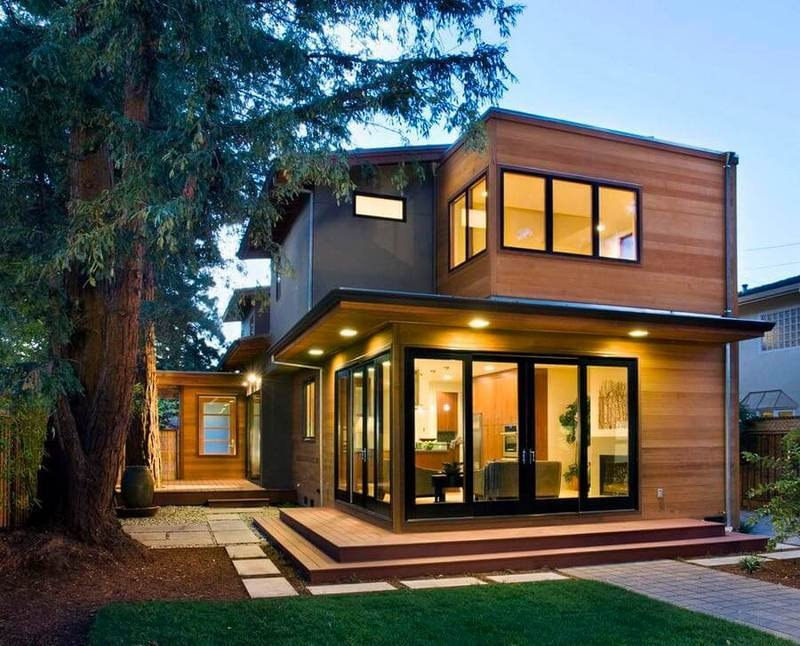
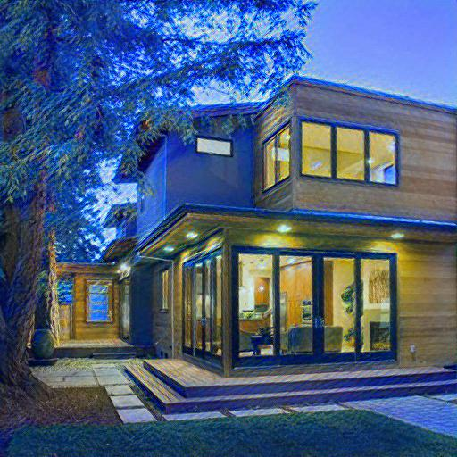
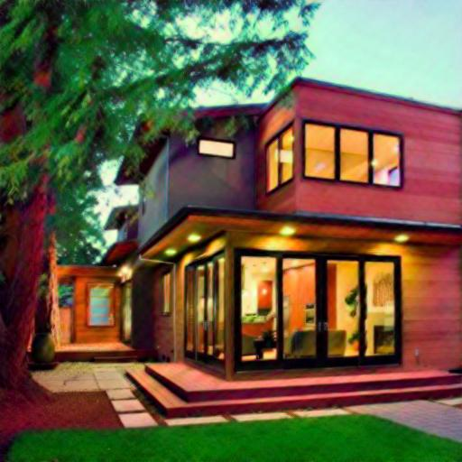
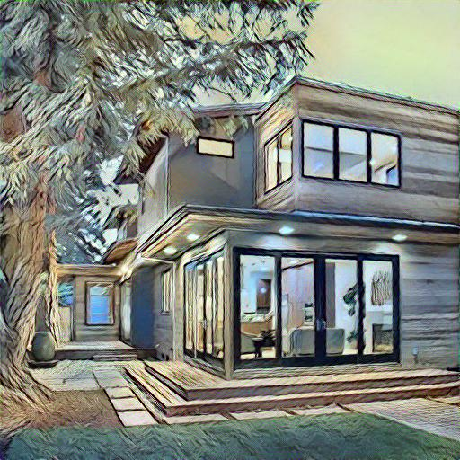
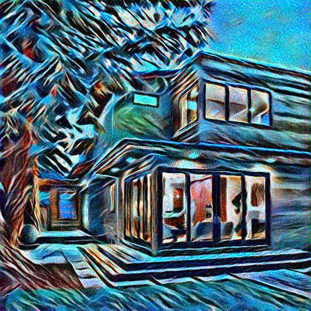
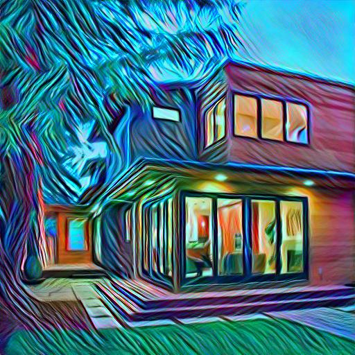
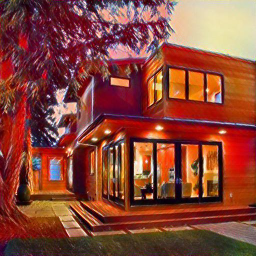
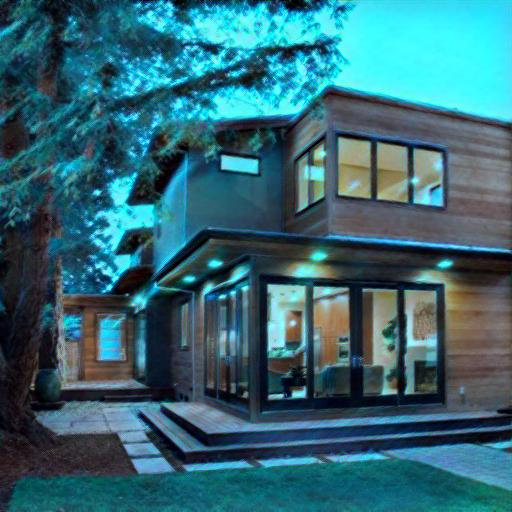

# dls-project

## Was testing python version
Python 3.9.7

## Description
За основу данного проекта был взят медленный алгоритм, провоходяищий каждый раз обучение 
на картинке контента, с импользованием матрицы Грама. В результате тренировки модели было выялено, что
в зависимости от исходного изображение, а так же изображения стиля, для корректной работы алгоритма и видимого результата преобразования 
необходимо разное количество иттераций. Соответственно для этого бот был расширен возмоностью выбора глубины обработки. При этом в качестве резульата бот отдает 2 изображения. Первое - с середины обучения и второе - полученное в результате прохождения всех иттераций.
Так же при тестировании было выявлено, что лучшее качество получается при выборе стиля, имеющего более выраженные 
абстрактные формы. Для улучшения юзабилити бота пользователю предложенны картинки стиля, показывающие наиболее интересный результат.

Так же при разработке механики обучения модели было учтено, что алгоритм может запускаться как на ЦПУ, так и на ГПУ. Для увеличения скорости 
работы алгоритма было принятно решение, при использовании ЦПУ уменьшать размеры выходного изображения (результат). Таким образом, 
запуская алгоритм на ГПУ размер выходного изображения будет 512х512, а при использовании ЦПУ 128х128

## Examples

Original  
  
Van Gog  
  
Pikasso  
  
Кисть  
  
Космос  
  
Зеленые линии  
  
Лава  
  
Лёд  
  

## Install
git clone https://github.com/zhekavafiev/dls-project.git  
pip install -r requirements.txt

## Prepare
You need creaate .env file with telegram bot key  
Example
bot_key="YOU BOT KEY"
  
## Start
python3 app/main.py
